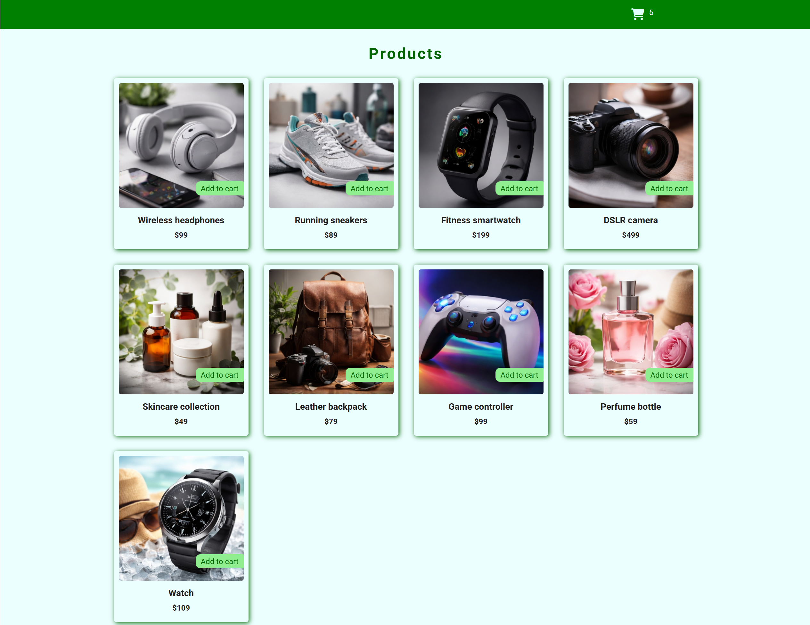
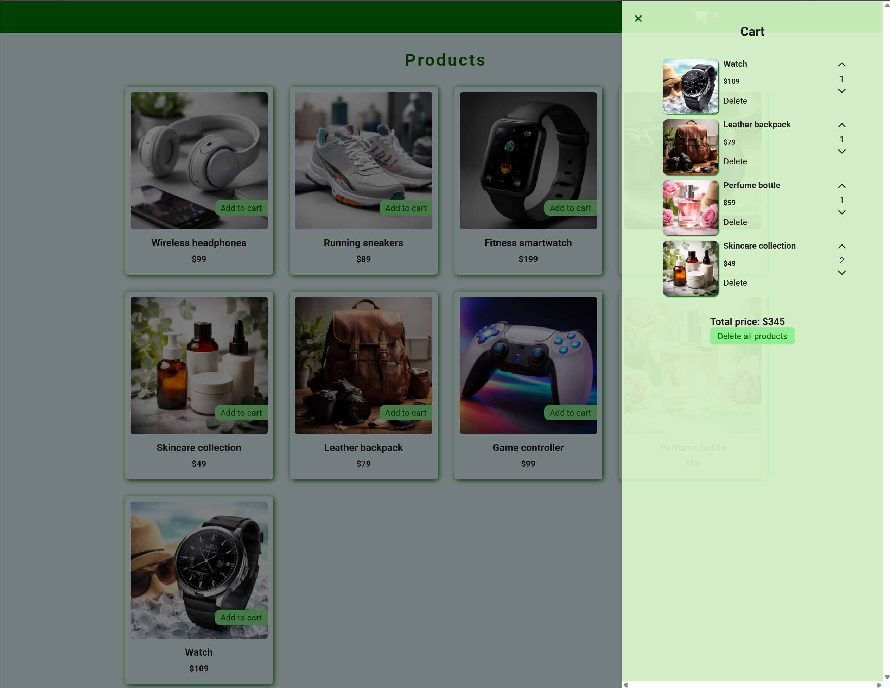

# 🛒 Shopping Cart (JavaScript)

A simple and interactive shopping cart application built with **JavaScript**.  
This project demonstrates core shopping cart logic, DOM manipulation, and real-time price calculations.

---

## ✨ Project Highlights

- Display product list
- Add products to cart
- Increase / decrease item quantity
- Remove items from cart
- Automatic total price calculation
- Dynamic UI updates without page reload

---
## 🎥 Demo

https://github.com/user-attachments/assets/241d65cc-09a2-401a-8c3f-68b088302e11

---

## 📸 Screenshots

### Product List



### Shopping Cart



---

## ⚡ Technologies Used

- HTML5
- CSS3
- JavaScript (ES6+)

---

## 📂 Project Structure
```
shopping-cart/
│
├── images/
├── styles/
│ └── main.css
├── products.json
├── app.js
└── index.html
```
